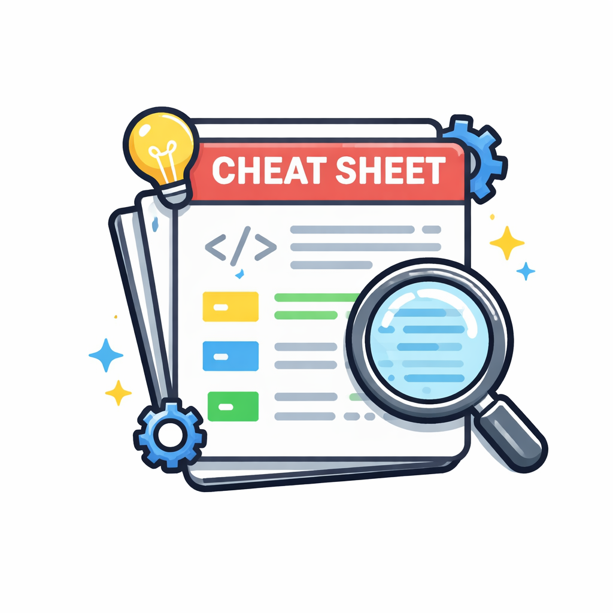

# Welcome to our Cheat Sheet

## Cheat Sheet

### Linux usage commads
- You can find here a lot of an Hebrew example of Linux and general daily command you better to know. https://github.com/websghost1/Linux_usage_commads

### DevOps by Nir Geier 
- Are you start learning on DevOps, start with the following:
  - https://github.com/Aviel-Amitay/awesome-devops
  - https://github.com/Aviel-Amitay/DevOps-Zero2Hero

- Ansible Labs example.  
https://github.com/Aviel-Amitay/AnsibleLab